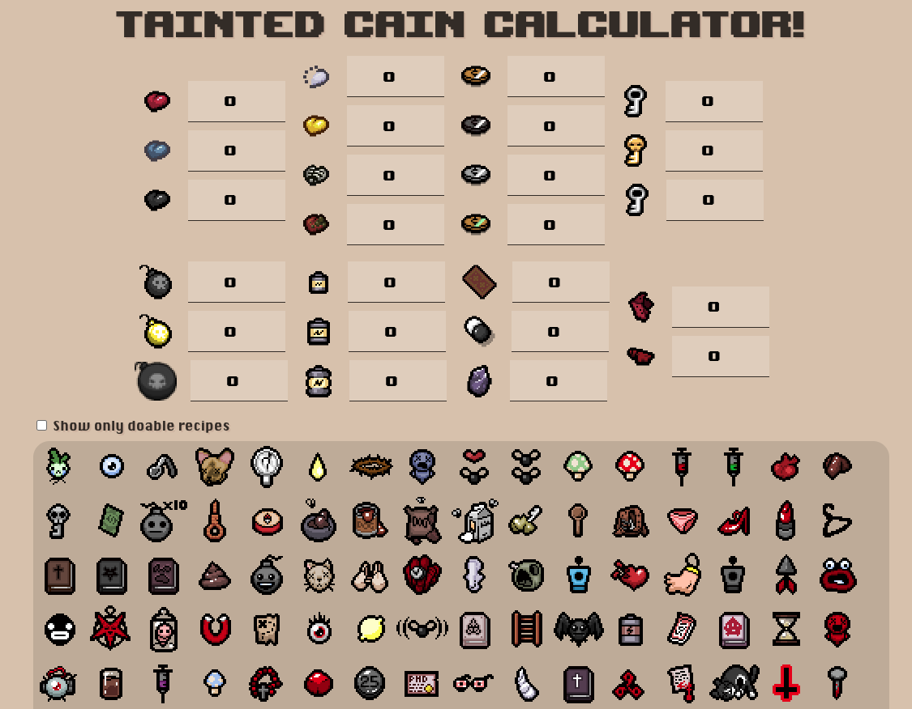

# Tainted Cain Calculator!

<center>

</center>
This is a companion webapp for the Tainted Cain character from The Binding Of Isaac : Rebirth last DLC, Repentance.<br/>
You manually enter pickups available on your floor and it show items that can be crafted with the Bag of Crafting.
<br/>

# WARNING : Not compatible with Repentance >v1.7.5, since recipes are now tied with run seed.
## DATA
- items come from the [Rebirth tracker repository](https://github.com/Rchardon/RebirthItemTracker)
- Recipes come from the [Binding of Isaac fandom wiki](https://bindingofisaacrebirth.fandom.com/wiki/Bag_of_Crafting_(Recipes)). I included a crappy handmade JS parser for the HTML tables rendered in the wiki tables in the `taintedcain-parser` folder.

## TODO
- dynamic recipe generation test?
- "plan to craft" and "favorite" modes
- "wildcard" pickup (suggested by catorze83)


## Project setup
This project uses VueJS + Vue CLI.
```
npm install
```

### Compiles and hot-reloads for development
```
npm run serve
```

### Compiles and minifies for production
```
npm run build
```
